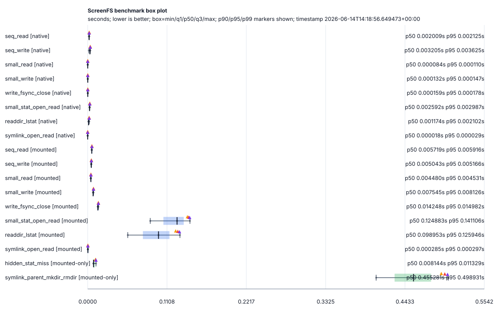
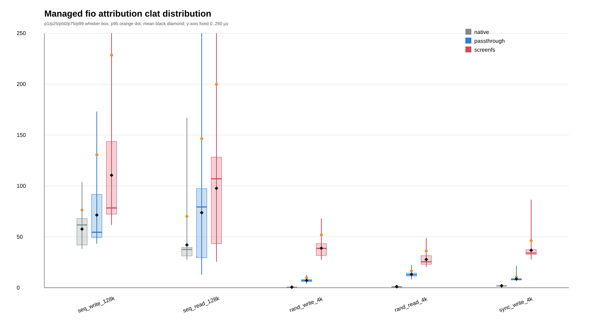

# ScreenFS

`ScreenFS`는 non-root FUSE3 기반 whole-root filesystem view layer다. 실제 `/`를 pass-through 하면서 visibility policy로 민감 경로를 없는 것처럼 숨기고(`ENOENT`), 보이는 경로에는 mutability policy로 쓰기 가능 여부를 적용한다.

대표 consumer는 sandbox/chroot supervisor지만, ScreenFS 자체는 특정 supervisor 전용 컴포넌트가 아니다.

```text
real / -> screenfs mount root -> sandbox/chroot consumer
```

## Project metadata

- Repository: <https://github.com/spi-ca/screenfs>
- License: BSD 3-Clause License. See [`LICENSE`](LICENSE).

## 핵심 계약

- **Whole-root view**: 프로젝트 디렉터리가 아니라 전체 `/` view를 제공한다.
- **Non-root FUSE3**: effective uid 0 실행은 mount 전에 거부하고, `fusermount3`, `fractal-fuse = 0.4.0`, `FUSE_OVER_IO_URING` 협상 성공을 기준으로 한다. 협상 실패는 fallback 없이 startup error다.
- **Visibility axis**: hidden path는 listing에서 제외하고 직접 접근은 `ENOENT`다.
- **Mutability axis**: visible path mutation만 writable/readonly로 판정한다. readonly mutation은 `EROFS`다.
- **Precedence**: hidden 또는 fully visible이 아닌 symlink target의 `ENOENT`가 mutability `EROFS`보다 항상 우선한다.
- **Bridge-visible ancestor**: visible carve-out에 도달하기 위한 ancestor는 traverse/list 전용으로 노출될 수 있고 mutation은 `EROFS`다.
- **No masking overlay**: `/dev/null` bind, 빈 파일, tmpfs masking처럼 이름을 남기는 masking이나 privileged mount에 의존하지 않는다.
- **Shutdown cleanup target**: mount lifecycle 변경은 `SIGINT`/`SIGTERM` 감지, cancellation handoff, FUSE serve-loop graceful exit, explicit `fusermount3 -u <mount-root>` cleanup 근거가 있어야 완료다. 일반 unmount 실패 시 lazy unmount는 자동 fallback이 아니라 option/manual command guidance로 다룬다.

## CLI quick reference

```text
screenfs <source-root> <mount-root> \
  [--config <path>] \
  [--visibility-default <visible|hidden>] \
  [--hidden <pattern> ...] \
  [--visible <pattern> ...] \
  [--mutability-default <writable|readonly>] \
  [--readonly <pattern> ...] \
  [--writable <pattern> ...]
```

- `<source-root>`: backing filesystem root. whole-root view에는 보통 `/`를 쓴다.
- `<mount-root>`: ScreenFS view를 mount할 기존 디렉터리.
- CLI에서 한 축 옵션을 하나라도 주면 그 축의 config block 전체를 대체한다. visibility와 mutability는 독립적으로 override된다.
- 제거된 legacy option은 compatibility mapping 없이 unknown option으로 거부한다.

## Config shape

```yaml
visibility:
  default: visible | hidden
  hidden: []
  visible: []

mutability:
  default: writable | readonly
  readonly: []
  writable: []
```

## Policy semantics at a glance

- `visibility.hidden`: entry는 `readdir`/`readdirplus`에서 빠지고 `lookup`/`getattr`/`open`/`access`/`readlink`는 `ENOENT`다.
- `visibility.visible`: hidden-by-default allowlist 또는 hidden 영역 내부 carve-out이다.
- current `visibility.visible`은 exact/subtree(`/dir`, `/dir/**`)와 direct-child anchor(`/dir/*`, `/dir/*.pem`, `/dir/id_*`, `/dir/.env.*`, bare/cwd/HOME 동등형)만 허용한다.
- `visibility.visible`의 recursive descendant form(`**/*.pem`, `/**/*.pem`, `/dir/**/*.pem`, `**/.git/hooks`, `/repo/**/.git/hooks` 등)은 recursive bridge discovery가 필요하므로 fail-fast다.
- `visibility.hidden`, `mutability.readonly`, `mutability.writable`은 recursive glob family와 recursive literal directory shorthand를 사용할 수 있다.
- 각 축은 most-specific rule wins를 따른다. 같은 축의 반대 polarity rule이 같은 normalized anchor/specificity에서 충돌하면 invalid configuration이다.
- listing success, cross-request direct-path memo, symlink decision cache는 point-of-use visibility check 면제 근거가 아니다.

## Examples

```bash
screenfs / /tmp/screenfs-root --config screenfs.yaml
```

대부분 보이게 두고 secret 숨기기:

```yaml
visibility:
  default: visible
  hidden:
    - /home/me/.ssh
    - '/**/*.pem'
mutability:
  default: writable
```

대부분 숨기고 한 subtree만 열기:

```yaml
visibility:
  default: hidden
  visible:
    - /workspace
mutability:
  default: writable
```

전체 readonly + 일부 writable carve-out + nested re-block:

```yaml
visibility:
  default: visible
mutability:
  default: readonly
  writable:
    - /tmp
  readonly:
    - /tmp/locked
```

## Documentation map

- [`docs/README.md`](docs/README.md): 문서 인덱스
- [`docs/requirements.md`](docs/requirements.md): 제품 요구사항과 non-goals
- [`docs/design.md`](docs/design.md): policy semantics와 구현 계약
- [`docs/architecture.md`](docs/architecture.md): 코드 경계와 데이터 흐름
- [`docs/operations.md`](docs/operations.md): 검증 절차와 current evidence map
- [`docs/benchmarks.md`](docs/benchmarks.md): formal benchmark workflow
- [`docs/performance-roadmap.md`](docs/performance-roadmap.md): measure-first 성능 backlog
- [`docs/diagrams/README.md`](docs/diagrams/README.md): Mermaid source/render contract


## Performance artifacts

Checked-in performance evidence lives under `docs/artifacts/**` and should be read as machine-local, warm-cache evidence unless the artifact records stronger cache controls.

- Perf-counter smoke result: [`current-perf-counter-benchmark-result.md`](docs/artifacts/current-perf-counter-benchmark-result.md), [`json`](docs/artifacts/current-perf-counter-benchmark-result.json), [`svg`](docs/artifacts/current-perf-counter-benchmark-result.svg). This current artifact uses `--workload-set all` and records the formal harness command line, workload ratios, directory/read-only-close workloads, and raw ScreenFS perf counters.
- Post-metadata follow-up before/after evidence: [`summary.md`](docs/artifacts/post-metadata-follow-up-claim/worktree-3cb95ba/summary.md) with paired directory-surface, glob-heavy directory-surface, read-only-close-surface, and metadata-open-path artifacts.
- Supplemental fio attribution: [`managed-fio-attribution-summary.md`](docs/artifacts/managed-fio-attribution-summary.md), [`perf-split json`](docs/artifacts/managed-fio-attribution-perf-split.json), [`boxplot svg`](docs/artifacts/managed-fio-attribution-boxplot.svg), [`boxplot png`](docs/artifacts/managed-fio-attribution-boxplot.png). This compares native, minimal managed passthrough, and ScreenFS fio latency attribution; it is attribution evidence, not claim-grade before/after evidence.





## Evidence

Recorded verification/evidence는 [`docs/operations.md`](docs/operations.md)와 `docs/artifacts/**`를 따른다. 문서상 목표 계약과 recorded artifact 상태를 구분하고, current contract evidence만 baseline으로 사용한다.
