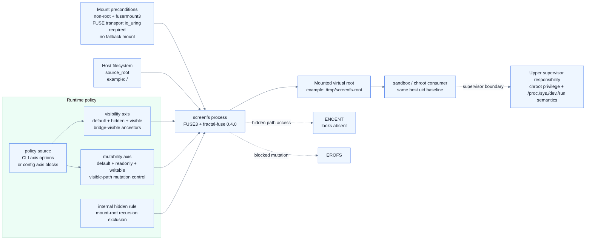
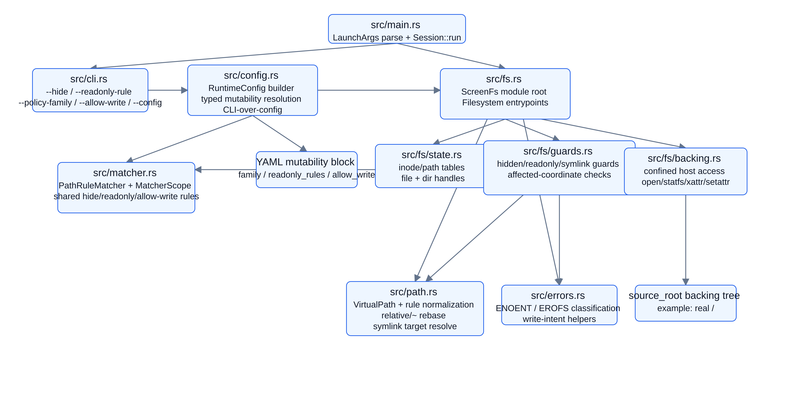

# ScreenFS

`ScreenFS`는 non-root FUSE 기반 whole-filesystem view layer다. 실제 `/` 파일시스템을 pass-through 하되, 지정한 경로는 존재하지 않는 것처럼 숨기고 visible path에는 별도 mutability policy를 적용할 수 있게 설계한다. 대표 통합 시나리오는 `pi-bash-sandbox` 같은 sandbox/chroot consumer지만, 그 용도에만 한정된 컴포넌트로 문서화하지 않는다.

### 시스템 컨텍스트



### 모듈 구조



다이어그램 원본과 공용 렌더링 규칙은 `docs/diagrams/README.md`를 따른다. `docs/diagrams/*.png`는 `docs/diagrams/mermaid-config.json`, `docs/diagrams/puppeteer-config.json`을 함께 사용하고 Mermaid CLI `--scale 2`로 생성하는 것을 저장소 기준으로 삼는다.

## 목적

`ScreenFS`의 기본 역할은 전체 `/`를 입력으로 받아 상위 consumer가 읽을 수 있는 whole-root view를 만드는 것이다. 대표적인 통합 형태는 다음과 같다.

```text
real / -> screenfs mount root -> sandbox/chroot consumer
```

대표 사용 시나리오(`pi-bash-sandbox` + chroot)는 아래와 같다.

```bash
screenfs / /tmp/screenfs-root \
  --hide /home/spi-ca/.ssh \
  --hide /home/spi-ca/.aws \
  --hide /home/spi-ca/.pi/agent/auth.json \
  --hide '/home/spi-ca/.pi/agent/mcp-oauth' \
  --hide '**/.env' \
  --hide '**/.env.*' \
  --hide '**/*.pem' \
  --hide '**/*.key'

chroot /tmp/screenfs-root /bin/bash
```

이 예시는 대표 통합 시나리오일 뿐이며, `ScreenFS` 자체의 핵심 역할은 특정 supervisor 하나가 아니라 whole-root consumer 전반에 재사용 가능한 filesystem view layer를 제공하는 데 있다.

## CLI quick reference

`screenfs --help`는 아래 surface를 기준으로 빠른 시작용 요약을 제공한다.

```text
screenfs <source-root> <mount-root> \
  [--config <path>] \
  [--hide <pattern> ...] \
  [--policy-family <selective-readonly|readonly-root-allowwrite>] \
  [--readonly-rule <pattern> ...] \
  [--allow-write <pattern> ...]
```

### Arguments

- `<source-root>`: mirror할 backing filesystem root. 보통 whole-root view를 위해 `/`를 사용한다.
- `<mount-root>`: ScreenFS view를 mount할 기존 디렉터리.

### Options

- `--config <path>`: YAML config를 로드한다. CLI mutability option을 하나라도 주면 config의 `mutability` block 전체를 대체한다.
- `--hide <pattern>`: 경로나 지원되는 glob을 숨긴다. 반복 가능하다. hidden path는 `ENOENT`처럼 보인다.
- `--policy-family <selective-readonly|readonly-root-allowwrite>`: mount당 하나의 mutability family를 선택한다.
- `--readonly-rule <pattern>`: `selective-readonly` family에서는 primary read-only rule이고, `readonly-root-allowwrite` family에서는 더 구체적인 nested re-block rule이다. 반복 가능하다.
- `--allow-write <pattern>`: `readonly-root-allowwrite` family에서는 primary write carve-out rule이고, `selective-readonly` family에서는 더 구체적인 nested carve-out rule이다. 반복 가능하다.

### Mutability families

- `selective-readonly`: 기본 writable, `--readonly-rule`에 매치된 path만 read-only.
- `readonly-root-allowwrite`: 기본 read-only, `--allow-write`에 매치된 path만 writable.

### Rules and precedence

- hidden path는 mutability rule보다 먼저 적용되며 계속 `ENOENT`가 우선한다.
- `--readonly-rule`와 `--allow-write`를 함께 쓰는 nested override 입력은 explicit `--policy-family`와 valid primary/secondary ancestor 관계가 필요하다.
- `--policy-family`를 생략하면 `--allow-write`만 있을 때 `readonly-root-allowwrite`로 추론하고, 그 외에는 `selective-readonly`가 기본이다.
- CLI mutability option이 없으면 config `mutability.family`가 family source of truth다.

### Examples

Hide secrets in a whole-root view:

```bash
screenfs / /tmp/screenfs-root \
  --hide /home/me/.ssh \
  --hide '**/*.pem'
```

Make selected paths read-only:

```bash
screenfs / /tmp/screenfs-root \
  --policy-family selective-readonly \
  --readonly-rule /etc/ssh
```

Make the whole view read-only except selected paths:

```bash
screenfs / /tmp/screenfs-root \
  --policy-family readonly-root-allowwrite \
  --allow-write /tmp
```

Use a YAML config file:

```bash
screenfs / /tmp/screenfs-root --config screenfs.yaml
```

현재 CLI/config surface에는 `--policy-family`, `--readonly-rule`, `--allow-write`, `--config`, YAML `mutability` block, one-family-per-mount 검증, CLI-over-config precedence가 구현돼 있다.

짧게 보면 현재 canonical mutability contract는 다음과 같다.

- `selective-readonly`: 기본 writable, `--readonly-rule` 매치 path/pattern은 `EROFS`; 더 구체적인 descendant `--allow-write` rule은 해당 subtree를 다시 writable로 carve out할 수 있다.
- `readonly-root-allowwrite`: 기본 readonly, `--allow-write` 매치 coordinate는 ScreenFS 차원의 `EROFS` 해제; 더 구체적인 descendant `--readonly-rule` rule은 해당 subtree를 다시 `EROFS`로 re-block할 수 있다.
- 한 mount는 정확히 하나의 family만 선택한다.
- hidden `ENOENT`가 항상 mutability보다 우선하고, visible mutability는 most-specific-match-wins로 판정한다.
- opposite-polarity rule을 함께 쓰려면 explicit family, less-specific primary ancestor, no same-specificity conflict 조건을 만족해야 한다.
- config는 `mutability.family`, `mutability.readonly_rules`, `mutability.allow_write`를 사용한다.
- CLI mutability option이 하나라도 있으면 config `mutability` block 전체를 대체한다.
- whole-mount readonly semantics는 `readonly-root-allowwrite` + empty `allow_write`로 표현한다.

검증/증거 문서는 역할별로 나뉘어 있다.

- pre-option-B repo-local family-aware smoke: `docs/artifacts/future-mutability-smoke-transcript.md`
- current whole-root carve-out smoke: `docs/artifacts/whole-root-family-smoke-transcript.md`
- current whole-mount readonly smoke: `docs/artifacts/whole-mount-readonly-smoke-transcript.md`
- pre-removal archival transcript: `docs/artifacts/fuse-smoke-transcript.md`

whole-mount readonly가 필요하면 현재 surface에서는 `readonly-root-allowwrite` family를 allow-write rule 없이 사용한다. 과거 `--readonly` 예시는 제거 이전 archival evidence로만 읽는다.

## 핵심 전제

- 일반 사용자 권한으로 실행한다.
- FUSE mount는 `fusermount3`를 사용한다.
- root-only mount, privileged bind mount, system-wide mount namespace 조작에 의존하지 않는다.
- `/dev/null` bind overlay, 빈 파일 overlay, tmpfs masking처럼 이름을 남기는 masking 방식을 사용하지 않는다.
- `fractal-fuse = 0.4.0` 기반 구현을 전제로 한다.
- FUSE3 및 `FUSE_OVER_IO_URING` 기반 사용을 목표로 한다.
- chroot root로 사용할 수 있도록 단일 프로젝트 디렉터리가 아니라 전체 `/` filesystem view를 제공한다.

## 동작 요구사항

### 전체 view + selective hiding

기본 정책은 전체 파일시스템 pass-through다. 경로가 hide rule에 걸리지 않으면 실제 파일시스템의 binary, shared library, config, runtime path를 그대로 보여줘야 한다. 이를 통해 chroot 내부에서 다음과 같은 표준 경로 구조가 보존되어야 한다.

```text
/
/bin
/usr
/lib
/lib64
/etc
/home
/tmp
/var
...
```

숨김 후보 예시는 다음과 같다.

```text
/home/<user>/.ssh
/home/<user>/.aws
/home/<user>/.gnupg
/home/<user>/.pi/agent/auth.json
/home/<user>/.pi/agent/mcp-oauth
**/.env
**/.env.*
**/*.pem
**/*.key
```

### Hidden path 처리

숨김 대상은 권한 오류가 아니라 가능한 한 존재하지 않는 경로처럼 보여야 한다. 필수 동작:

- `readdir`: 결과에서 제외
- `readdirplus`: 결과에서 제외
- `lookup`: `ENOENT`
- `getattr`: `ENOENT`
- `open`: `ENOENT`
- `access`: `ENOENT`

일반 명령에서 기대되는 결과:

```bash
ls
find
rg
stat hidden-path
cat hidden-path
```

- 목록에는 숨김 대상이 나타나지 않는다.
- 직접 접근하면 `No such file or directory`로 실패한다.
- 단순 `Permission denied`로 존재를 노출하지 않는다.

### Selective readonly rule

hide rule과 별개로 visible path의 mutability policy를 제어하는 selective readonly rule을 지원한다. 현재 소스와 mount-free unit test가 `selective-readonly` family의 `--readonly-rule` 동작, nested `--allow-write` carve-out, hidden `ENOENT` precedence, symlink/write-intent handling, non-match visible path writable behavior를 함께 검증한다. nested override 설계 배경은 [docs/nested-mutability-option-b.md](docs/nested-mutability-option-b.md)에 남겨 둔다.

현재 목표 계약(path-scoped selective readonly):

- hidden path는 selective readonly 여부와 관계없이 `ENOENT`다.
- readonly rule에 매치된 visible path의 read/stat/list는 허용한다.
- readonly rule에 매치된 path의 모든 쓰기성 operation은 `EROFS`로 실패한다.
- readonly rule에 매치되지 않은 visible path는 이 요구사항만으로 자동 readonly가 되지 않는다.

정책 family 공통 invariant:

- hidden path는 어떤 mutability policy family에서도 계속 `ENOENT`가 우선이다.
- hidden `ENOENT` 우선순위는 readonly/allowWrite 같은 후행 policy 판정보다 앞선다.
- hide rule, `--readonly-rule`, `--allow-write` surface는 같은 rule-input normalization contract를 재사용해야 한다.

현재 소스와 mount-free test에 반영된 `readonly-root-allowwrite` family는 다음 계약을 따른다.

- 이 family는 `pi-bash-sandbox` 같은 integration use case가 기대하는 "기본은 readonly, 일부 path만 writable" 요구를 설명하는 대표 예시일 수 있지만, `ScreenFS`의 범용성을 제한하는 전용 모드는 아니다.
- primary `allowWrite` rule들은 union semantics로 합쳐지며, 하나라도 매치되면 해당 mutation coordinate는 carve-out 후보가 된다. 더 구체적인 nested `readonly` rule은 그 후보 subtree를 다시 `EROFS`로 re-block할 수 있다.
- hidden path나 hidden target이 하나라도 관여하면 `allowWrite`/nested `readonly`보다 hidden `ENOENT`가 우선한다.
- mutation은 관련된 모든 write-requiring affected coordinate가 현재 family 기준으로 writable이어야만 허용된다. 예를 들어 `copy_file_range`는 destination path/parent는 writable이어야 하지만 source는 hidden/read visibility 대상이다.
- current `allow_write`/`--allow-write` surface도 hide/current readonly와 같은 exact path + supported prefixed glob normalization contract를 재사용한다.
- canonical contract는 legacy bool surface를 포함하지 않으며, config schema에도 별도 legacy bool을 두지 않는다.
- 현재 소스는 정책 family 선택, shared normalization, operation-aware affected-path evaluation까지 반영한다.
- mutability family 집합은 현재 spec에서 `selective-readonly`와 `readonly-root-allowwrite` 두 개로 닫고, future deny-like family와의 조합은 현재 spec 범위 밖으로 둔다.
- family별 repo-local live smoke baseline은 `docs/artifacts/future-mutability-smoke-transcript.md`에 있고, current whole-root carve-out smoke는 `docs/artifacts/whole-root-family-smoke-transcript.md`, current whole-mount readonly smoke는 `docs/artifacts/whole-mount-readonly-smoke-transcript.md`, pre-removal historical smoke는 `docs/artifacts/fuse-smoke-transcript.md`로 분리되어 있다. option B nested override live smoke는 별도 fresh artifact가 필요하다.

쓰기성 operation 범위:

```text
write
create
mkdir
mknod
unlink
rmdir
rename
link
symlink
setattr 중 mutation
fallocate
```

### Rule input 정규화

hide rule, `--readonly-rule`, `--allow-write`는 같은 rule-input normalization contract를 공유한다. 현재 코드와 테스트 기준 핵심만 보면 다음과 같다.

- exact path와 supported prefixed glob 모두 같은 normalization을 사용한다.
- absolute 입력은 virtual-root anchored semantics를 유지한다.
- relative 입력은 process cwd 기준 host path로 해석한 뒤, 결과가 `source_root` 내부일 때만 virtual absolute path 또는 virtual glob prefix로 rebase한다.
- `~`, `~/...` 입력은 `HOME` 기준 host path로 expand한 뒤 같은 rebasing 규칙을 적용한다.
- 현재 구현 snapshot의 supported glob grammar는 recursive basename/suffix/basename-prefix tail(`**/<basename>`, `**/*.<suffix>`, `**/<basename-prefix>*`) + optional normalized path prefix, 그리고 normalized-prefix direct-child basename-prefix/suffix form(`<normalized-prefix>/<basename-prefix>*`, `<normalized-prefix>/*.<suffix>`)까지다.

현재 구현/문서화된 예시:

- `**/*.pem`
- `**/.env`
- `**/.env.*`
- `./fixtures/**/*.pem`
- `~/fixtures/**/*.pem`
- `/home/spi-ca/**/*.pem`
- `/home/spi-ca/.env.*`
- `~/.env.*`
- `./fixtures/*.pem`
- `~/*.pem`
- `/home/spi-ca/*.pem`

현재 소스/테스트 증거에서 direct-child suffix subset도 확인된다.

- matcher 단위: `src/matcher.rs`의 `normalizes_direct_child_suffix_glob_rules`
- shared config surface: `src/config.rs`의 `hide_and_readonly_rules_accept_direct_child_suffix_forms_through_runtime_config`, `allow_write_rules_accept_direct_child_suffix_forms_through_runtime_config`
- unsupported bare suffix 유지: `src/config.rs`의 `bare_suffix_globs_stay_unsupported_on_hide_and_mutability_surfaces`
- hidden `ENOENT` 우선순위 유지: `src/fs.rs`의 `hidden_direct_child_suffix_rules_keep_enoent_precedence_over_readonly`

다음 입력은 계속 fail-fast다.

- `HOME` 없는 `~` expansion
- `source_root` 밖으로 나가는 expanded path
- `~user`
- prefix 내부 wildcard
- 더 넓은 unsupported glob (`foo/*/bar.pem`, `**/secret?.pem`, bare suffix `*.pem`, brace/env/command expansion)

검증은 unit test, CLI fail-fast stderr, repo-local family-aware smoke transcript를 함께 근거로 읽는다. direct-child suffix form의 현재 근거는 source/unit-test 쪽에 있고, live smoke는 relative exact path, relative/`~` recursive prefixed glob, config-backed source-of-truth 같은 대표 경로를 보강한다. 아직 별도 live artifact가 필요한 쪽은 already-absolute case와 broader unsupported wildcard fail-fast다.

### 성능 및 메모리 방향

전체 filesystem view는 metadata-heavy workload가 많을 수 있으므로 다음 방향을 구현 기준으로 삼는다.

- `readdirplus` 구현으로 directory listing 중 metadata round-trip을 줄인다.
- inode/path cache를 둔다.
- file handle을 재사용한다.
- hidden matcher를 빠르게 처리한다.
- glob rule 수가 늘어도 성능 저하가 급격하지 않게 한다.
- visible file data path는 가능한 한 underlying filesystem으로 pass-through 한다.
- 장시간 실행해도 memory footprint가 과도하게 증가하지 않도록 cache eviction/상한을 설계한다.

## 현재 구현 상태

현재 저장소에는 Rust 기반 구현이 포함되어 있다.

- CLI/config surface가 구현되어 있다: `<source-root> <mount-root>`, 반복 `--hide`, 반복 `--readonly-rule`, `--policy-family`, 반복 `--allow-write`, `--config`, YAML `mutability` block
- mutability family resolution이 구현되어 있다: `selective-readonly`/`readonly-root-allowwrite`, one-family-per-mount, CLI-over-config precedence, CLI 부재 시 config source-of-truth, 둘 다 없을 때 `selective-readonly` 기본값
- lexical virtual path normalization과 symlink target 해석이 구현되어 있다.
- hide/readonly/allow-write matcher가 구현되어 있다: virtual root 기준 absolute exact rule, relative/`~` exact rule rebasing, directory prefix hiding, prefix 없는 limited basename/suffix/prefix glob, recursive absolute/relative/`~` prefixed limited glob, normalized-prefix direct-child basename-prefix/suffix form(`~/.env.*`, `~/*.pem`, `./fixtures/*.pem`, `/prefix/*.pem` 등), shared normalization contract. bare suffix `*.pem`, wildcard-in-prefix, broader unsupported glob은 계속 fail-fast다.
- hidden/readonly guard 분류가 구현되어 있다: hidden path는 `ENOENT`, final mutability가 readonly인 mutation은 `EROFS`, hidden precedence는 selective/carve-out family와 nested override 모두에서 유지된다.
- affected-coordinate evaluator가 구현되어 있다: `create`/`mkdir`/`unlink`/`rename`/`link`/`symlink`/`copy_file_range`/xattr/`fallocate`에서 source/target/parent별 hidden/readonly 판정을 수행한다.
- 기본 FUSE 조회 경로가 구현되어 있다: `lookup`, `getattr`, `open`, `read`, `readdir`, `readdirplus`, `readlink`, `access`, `statfs`
- mount-free regression coverage가 구현되어 있다: host permission 기반 `access` pass-through, hidden target symlink에 대한 `lookup`/`open`/`readlink` guard, `readonly-root-allowwrite` empty-carve-out mount의 `create` `EROFS` 반환
- mount-free unit test coverage는 parser/path/matcher/guard/FUSE baseline 동작, relative/`~` exact·prefixed-glob normalization, direct-child basename-prefix/suffix glob normalization, hide/current family rule shared semantics, selective readonly scoped-path coverage, option B nested allow-write/re-block precedence와 fail-fast validation, readonly-root-allowwrite union/precedence/affected-coordinate-wide writable requirement, config mutability load/override, access/symlink/create regression, hidden multi-path mutation·xattr guard, symlink target hiding, `copy_file_range` visible/hidden 경로를 대상으로 한다. 현재 세션에서 `cargo test --all-targets --all-features` 기준 78 tests가 통과했으며 fresh pass evidence는 `docs/operations.md`의 검증 표를 따른다. repo-local family-aware live smoke baseline transcript도 별도로 존재한다.

아직 완료로 주장하지 않는 범위:

- family-by-family whole-root/chroot matrix 완전 충족
- production-ready 전체 FUSE 동작 완성
- chroot 통합 완료
- privileged end-to-end 운영 검증 완료

최신 documented live FUSE smoke evidence(2026-06-11 기준): `/dev/fuse`가 존재하는 환경에서 repo-local family-aware fixture mount, current `source-root=/` whole-root carve-out mount, current `source-root=/` whole-mount readonly mount가 확인됐다. repo-local transcript(`docs/artifacts/future-mutability-smoke-transcript.md`)는 option B 도입 전 baseline으로 `selective-readonly` mount에서 relative hide exact path `ENOENT`, relative/`~` prefixed glob readonly rule `EROFS`, non-match visible mutation 성공을 기록하고, `readonly-root-allowwrite` mount에서 allow-write carve-out 성공, non-match `EROFS`, hidden `ENOENT`, config-backed source-of-truth, pre-option-B CLI conflict fail-fast stderr를 남긴다. whole-root carve-out transcript(`docs/artifacts/whole-root-family-smoke-transcript.md`)는 `readonly-root-allowwrite --allow-write /tmp` 기준으로 `stat /bin/bash`, `ls /usr`, hidden `/home/spi-ca/.ssh`의 `ENOENT`, `/tmp` write 성공, `/var/tmp` mutation `EROFS`, `unshare -UrR` 기반 chroot allow/block smoke를 담는다. whole-mount readonly transcript(`docs/artifacts/whole-mount-readonly-smoke-transcript.md`)는 `readonly-root-allowwrite` with empty `allow_write` 기준으로 `touch`/`mkdir` `EROFS`, hidden `ENOENT`, `unshare -UrR` chroot 내부 `/tmp` mutation `EROFS`를 담는다. option B nested override live smoke는 새 artifact가 필요하다. pre-removal transcript(`docs/artifacts/fuse-smoke-transcript.md`)는 제거 이전 CLI surface의 archival evidence로만 남긴다. FUSE mount는 `nodev`이므로 `/dev/null` 같은 device-node 동작은 상위 supervisor/namespace layer에서 별도 제공해야 한다 (`docs/operations.md` 참고).

추가로 확인된 환경:

- `fractal-fuse = 0.4.0`
- kernel: `7.1.0-rc6-1-spica-git`
- kernel config artifact: `/home/spi-ca/Codebase/packages/managed/linux-spica-git/config.saved.x86_64`
- documented kernel config flags: `CONFIG_FUSE_IO_URING=y`, `CONFIG_IO_URING=y`
- `fusermount3`: `/usr/bin/fusermount3`
- `fusermount3 version`: `3.18.2`

위 kernel config artifact는 `FUSE_OVER_IO_URING` 요구사항의 환경 전제 증거이며, 그 자체로 새로운 live mount smoke 또는 협상 성공을 의미하지는 않는다.

## 추가 문서

- [아키텍처 개요](docs/architecture.md)
- [요구사항](docs/requirements.md)
- [설계 노트](docs/design.md)
- [Nested mutability option B adopted design](docs/nested-mutability-option-b.md)
- [운영 및 검증](docs/operations.md)
- [Pi role agents](docs/pi-agents.md)
