# ScreenFS 아키텍처 개요

이 문서는 현재 목표 계약(`README.md`, `docs/requirements.md`, `docs/design.md`, `docs/operations.md`)을 기준으로 정리한 아키텍처 요약이다. 구현 코드(`src/*.rs`)는 이 계약을 만족하도록 갱신되어야 한다. shared matcher는 bare slashless direct-child, anchored direct-child, subtree shorthand, recursive glob family를 정규화하되, current `visibility.visible` surface는 exact/subtree와 direct-child anchor bridge만 허용해야 한다. `**/*.pem`, `/**/*.pem`, `/dir/**/*.pem`, `**/.git/hooks/**`, `**/.git/hooks`, `/repo/**/.git/hooks/**`, `/repo/**/.git/hooks` 같은 recursive descendant visible glob/shorthand은 recursive bridge discovery가 필요하므로 shorthand와 canonical form 모두 current contract가 아니다. recursive family와 recursive literal directory shorthand는 `visibility.hidden`, `mutability.readonly`, `mutability.writable`에서만 current이며, shorthand는 `**/<literal-dir>`와 `<prefix>/**/<literal-tail>`만 허용되고 내부적으로 `<prefix>/**/<literal-tail>/**`로 normalize되어도 추가 discovery cost를 만들면 안 된다. `/**/`는 최대 한 번만 허용되고 tail component는 모두 literal이다. current evidence는 `docs/operations.md`를 따른다.

- source of truth: 목표 계약은 `README.md`, `docs/requirements.md`, `docs/design.md`; 구현은 `src/`에서 이 계약을 따라야 한다.
- 이 문서는 승인된 목표 계약을 `visibility.*` / `mutability.*` 축으로 설명한다.
- current CLI/config reference는 두 축 문서를 따른다.
- 런타임 전제: non-root + `fusermount3`, `FUSE_OVER_IO_URING` 필수, 협상 실패 시 fallback 없이 fail-fast
- 통합 경계: mount owner와 동일 host uid 접근이 기본 전제이며, chroot 권한 모델과 `/proc`·`/sys`·`/dev`·`/run` native semantics는 상위 supervisor 책임이다
- 다이어그램 source of truth: `docs/diagrams/*.mmd`
- 다이어그램 렌더링 계약: `docs/diagrams/README.md`

## 1. 시스템 컨텍스트

ScreenFS는 `source_root`(대표 예시는 `/`)를 backing tree로 삼아 FUSE mount를 만들고, 그 mount를 sandbox/chroot 같은 상위 consumer가 읽는 구조다. `pi-bash-sandbox`는 대표 통합 예시지만 시스템 경계 자체는 특정 supervisor 하나에 고정되지 않는다. 아래 그림의 mount path는 `/tmp/screenfs-root` 예시일 뿐 고정 경로가 아니다.

정책 모델은 두 축이다.

- visibility axis
  - `visibility.default`
  - `visibility.hidden`
  - `visibility.visible`
  - bridge-visible ancestor
- mutability axis
  - `mutability.default`
  - `mutability.readonly`
  - `mutability.writable`
  - hidden-before-mutability precedence

현재 소스/증거를 이 축으로 읽으면 hidden `ENOENT`, bridge-visible ancestor, readonly/writable override, mount-root recursion exclusion이 핵심 축이다. mount-level `ro`만으로는 충분하지 않다.



다이어그램 원본: [diagrams/README.md](diagrams/README.md)

구현 파일 바로가기: `README.md`, `docs/design.md`, `docs/operations.md`

## 2. 모듈 아키텍처

현재 코드는 `main -> cli/config -> fs`를 중심으로 구성되어 있고, `src/fs.rs`는 module root/orchestrator로서 `src/fs/state.rs`, `src/fs/guards.rs`, `src/fs/backing.rs`에 inode/file-handle state, path guard, confined host access를 위임한다. `src/matcher.rs`의 `PathRuleMatcher`는 visibility/mutability rule compilation과 runtime policy checks에 공유된다.



다이어그램 원본: [diagrams/README.md](diagrams/README.md)

핵심 포인트:

- `src/main.rs`: mount option 구성과 `Session::run(ScreenFs::new(cfg))` 진입점
- `src/cli.rs`: launch input 파싱, default/override 관계 검증, help text와 fail-fast 진입점
- `src/config.rs`: `RuntimeConfig` 구성, mount-root recursion exclusion internal hidden rule 주입, visibility/mutability source 기록, matcher compilation, config/launch precedence 조립
- `src/path.rs`: lexical virtual path normalization, symlink target lexical resolution, source-root confinement 보조, relative/`~` exact·prefixed-glob rule input rebasing helper
- `src/matcher.rs`: `PathRuleMatcher`와 `MatcherScope`를 제공한다. 목표 계약에서는 exact/subtree, direct-child glob, recursive non-visible glob, recursive literal non-visible subtree descriptor를 family별로 compile하고, `visibility.visible` validator가 subtree/direct-child current subset만 통과시켜야 한다. recursive literal directory shorthand는 `**/<literal-dir>`와 `<prefix>/**/<literal-tail>`만 허용하고 canonical trailing `/**` descriptor로 normalize되어 same-specificity conflict/dedup/containment 결과와 matcher cost가 동일해야 한다. `~/**/bbb/**/ccc`, `**/.git/**/hooks`, `**/.git/*/hooks`, `**/foo?`, `**/[abc]` 같은 form은 fail-fast 대상이다. dynamic bridge scan root나 recursive visible glob support를 추가하지 않는다.
- `src/fs.rs`: `ScreenFs` FUSE 구현의 module root/orchestrator. request entrypoint를 `src/fs/state.rs`, `src/fs/guards.rs`, `src/fs/backing.rs`와 조합한다.
- `src/fs/state.rs`: inode/path map, lookup/open refcount, optional per-handle directory iteration state를 관리한다.
- `src/fs/guards.rs`: hidden guard, bridge-visible guard, symlink target guard, mutation coordinate guard, directory filtering과 reply-building 전 검사를 담당한다.
- `src/fs/backing.rs`: `source_root` confinement 하의 host delegation, open/statfs/xattr/setattr helper를 담당한다.
- `src/errors.rs`: hidden 우선 `ENOENT`, mutation 차단 `EROFS`, host errno 보존 규칙을 담당한다.

구현 파일 바로가기: `src/main.rs`, `src/cli.rs`, `src/config.rs`, `src/path.rs`, `src/matcher.rs`, `src/errors.rs`, `src/fs.rs`, `src/fs/state.rs`, `src/fs/guards.rs`, `src/fs/backing.rs`

## 3. 요청 처리 결정 흐름

목표 요청 처리 흐름은 virtual path 계산 후 visibility 판정이 먼저, discovery-free visible rule category에 따른 bridge-visible 합성과 현재 directory/parent 기준 directory filtering, 필요 시 symlink target point-of-use fully-visible 검사, 그 뒤 mutability evaluator 판정이 이어지고, host filesystem delegation이 마지막 순서로 진행된다.

1. virtual path 계산
2. `visibility.hidden` / `visibility.visible` 평가
3. subtree/direct-child visible rule metadata만으로 bridge-visible ancestor를 합성하고 recursive bridge discovery는 수행하지 않음
4. `readdir`/`readdirplus`라면 현재 directory/parent와 관련된 matcher bucket만 보고 unrelated bucket은 건너뛰는 보수적 filtering 수행
5. 필요 시 symlink target이 fully visible인지 point-of-use에서 검사
6. mutation이면 `mutability.default` + 더 구체적인 readonly/writable override 평가
7. hidden이 아니고 mutation이 허용되면 host filesystem delegation



다이어그램 원본: [diagrams/README.md](diagrams/README.md)

정책 축 세부 흐름:





다이어그램 원본: [diagrams/README.md](diagrams/README.md)

핵심 포인트:

- hidden path는 가능한 한 존재하지 않는 것처럼 보여야 한다.
- hidden 판단은 mutability보다 먼저 적용된다.
- readonly/writable은 visible mutation에만 적용된다.
- symlink는 entry path뿐 아니라 resolved virtual target도 검사하며, target이 fully visible이 아니고 hidden 또는 bridge-visible이면 `ENOENT`다.
- symlink target check는 policy가 hide 가능성을 배제할 때만 생략할 수 있고, prior listing success나 direct-path-only memoized result는 면제 근거가 아니다.
- `rename`/`link`/`symlink`/`copy_file_range` 같은 multi-path 연산은 source/target/parent 각각을 다시 검사한다.
- bridge-visible ancestor는 traversal/listing 전용이며 mutation에는 `EROFS`다.

구현 파일 바로가기: `src/fs.rs`, `src/errors.rs`, `docs/design.md`

## 4. 경로 정규화와 confinement

`PathRuleMatcher` 기반 matching은 host canonical path가 아니라 lexical virtual path 기준으로 동작한다. 이후 backing 접근은 `source_root` 밖으로 빠져나가지 않도록 제한한다. 아래 다이어그램은 특히 visible symlink entry를 직접 다루는 경로를 기준으로 읽는 것이 정확하다.



다이어그램 원본: [diagrams/README.md](diagrams/README.md)

핵심 포인트:

- `.` 제거, 중복 `/` 정리, `..`는 virtual `/` 위로 못 올라감
- shared matcher family는 exact/subtree, direct-child glob, recursive non-visible glob, recursive literal non-visible subtree로 나뉜다. `/dir/**`는 `/dir`와 같은 subtree descriptor로 compile되고, bare slashless glob `<pattern>`은 launch process cwd를 `source_root` relative normalized prefix로 rebase한 `./<pattern>` direct-child shorthand다. prefixless recursive tail `**/<pattern>`은 같은 cwd anchor의 `./**/<pattern>` recursive shorthand target이다. recursive literal non-visible subtree family는 canonical form(`**/.git/hooks/**`)과 recursive literal directory shorthand(`**/.git`, `**/.git/hooks`, `~/**/aaa/hook`)를 함께 받아들이되 shorthand를 canonical descriptor로 normalize한다. 허용 shorthand는 `**/<literal-dir>`와 `<prefix>/**/<literal-tail>`뿐이고 `/**/`는 최대 한 번만 허용되며 tail component는 모두 literal이다. 이는 subtree shorthand(`/dir/**`, `~/aa/**`)와 다른 문법이다.
- current `visibility.visible` subset은 `/dir`, `/dir/**` 같은 subtree와 `/dir/*`, `/dir/*.pem`, `/dir/id_*`, `/dir/.env.*`, bare/cwd/HOME 동등형 direct-child rule뿐이다. direct-child visible rule은 normalized anchor ancestor만 bridge-visible candidate로 쓰고 immediate child를 `lookup`/`readdir`/`readdirplus`에서 현재 directory/parent 기준으로 평가하며 unrelated matcher bucket은 건너뛴다.
- `visibility.visible`에 `**/*.pem`, `/**/*.pem`, `/dir/**/*.pem`, `**/.git/hooks/**`, `**/.git/hooks`, `/repo/**/.git/hooks/**`, `/repo/**/.git/hooks`, cwd/HOME-relative recursive descendant canonical/shorthand form이 들어오면 recursive bridge discovery가 필요하므로 fail-fast다. 같은 recursive family와 recursive literal directory shorthand는 hidden/readonly/writable에서만 current다.
- relative path와 leading `~`, `~/...` prefix는 host path로 해석된 뒤 `source_root` 내부일 때만 virtual absolute path 또는 virtual glob prefix로 rebase된다.
- `HOME` 없음, relative path/prefixed glob/bare slashless shorthand/prefixless recursive shorthand를 정규화할 launch cwd가 `source_root` 밖, `source_root` 밖으로 확장됨, `~user`, prefix 내부 wildcard, broader unsupported wildcard forms(`foo/*/bar.pem`, `**/secret?.pem`, unanchored `**/*`, one-sided subset 밖의 bare wildcard `*`, `a*b`, `*secret*`)은 fail-fast/unsupported로 남는다.
- descendant-subtree broader forms(`~/**/bbb/**/ccc`, `**/.git/**/hooks`, `**/.git/*/hooks`, `**/foo?`, `**/[abc]`, shorthand subset 밖 trailing `/**`-less broader/ambiguous form)도 부분 해석 없이 fail-fast다.
- recursive literal directory shorthand support는 normalization/path-matcher-only여야 한다. `**/.git/hooks`, `~/**/aaa/hook` 같은 supported shorthand는 각각 `**/.git/hooks/**`, `~/**/aaa/hook/**`와 같은 matcher cost를 유지해야 하며 recursive bridge discovery, lazy discovery, startup scan, background indexing, listing 결과 cache, symlink decision cache, 기타 새로운 filesystem discovery를 추가하면 안 된다.
- symlink target은 lexical virtual target으로 재해석해 fully-visible 여부를 다시 검사하며, hidden 또는 bridge-visible target은 `readlink`/dereference에서 `ENOENT`다.
- 이 fast path는 current supported grammar에만 적용되며 unsupported visible recursive form이나 broader wildcard form을 근사하지 않는다. symlink-dependent check는 policy가 hide 가능성을 배제하지 못하면 listing/lookup/getattr/readlink/dereference/open 시점마다 다시 수행한다.
- host backing 접근은 `source_root` 밖 escape를 허용하지 않는다.

구현 파일 바로가기: `src/path.rs`, `src/matcher.rs`, `src/fs.rs`

## 5. 운영/통합 경계

이 아키텍처가 전제하는 운영 경계는 다음과 같다.

- mount 생성은 non-root 사용자 + `fusermount3` 기준이다.
- `FUSE_OVER_IO_URING` 협상 실패 시 mount를 degraded fallback으로 열지 않고 fail-fast 한다.
- 기본 접근 모델은 mount owner와 동일 host uid다.
- 다른 host uid 접근은 `allow_other`와 `/etc/fuse.conf` 정책이 별도로 필요하다.
- `chroot` 실행 권한, user namespace, supervisor 구성은 `ScreenFS` 바깥 책임이다 (`pi-bash-sandbox`는 대표 예시일 뿐 유일한 상위 레이어는 아님).
- `/proc`·`/sys`·`/dev`·`/run`의 native semantics 재현도 `ScreenFS` 단독 책임이 아니다.

구현 파일 바로가기: `README.md`, `docs/design.md`, `docs/operations.md`

## 6. 검증 경계

이 문서는 구조를 설명하는 artifact이고, live proof의 source of truth는 `docs/operations.md`다. 이 artifact를 읽고 바로 연결되어야 하는 최소 검증 질문은 다음이다.

- `visibility.hidden` entry가 `readdir`/`readdirplus`에서 실제로 빠지는가
- hidden 직접 접근이 `ENOENT`인가
- visibility axis diagram이 hidden/bridge-visible/visible 흐름, symlink fully-visible gate, listing 제한을 설명하는가
- mutability axis diagram이 hidden-before-EROFS와 affected-coordinate writable 요구를 설명하는가
- `visibility.visible` carve-out이 subtree/direct-child current category로만 문서화되고, direct-child bridge가 immediate child evaluation만 사용하며 hidden sibling을 노출하지 않는가
- `readdir`/`readdirplus` filtering이 현재 directory/parent와 무관한 matcher bucket을 건너뛰어도 결과를 바꾸지 않는 evidence가 있는가
- `visibility.visible`이 `**/*.pem`, `/**/*.pem`, `/dir/**/*.pem`, `**/.git/hooks/**`, `**/.git/hooks`, `/repo/**/.git/hooks/**`, `/repo/**/.git/hooks`, cwd/HOME-relative recursive descendant canonical/shorthand form을 unsupported/fail-fast로 거부하는가
- `mutability.default=writable`에서 readonly match가 `EROFS`인가
- `mutability.default=readonly`에서 writable carve-out success와 carve-out 밖 `EROFS`가 갈리는가
- nested `mutability.readonly` re-block가 다시 `EROFS`를 만드는가
- hidden-before-mutability precedence가 유지되는가
- shared matcher가 `**/*.pem`=`./**/*.pem`, `*.pem`=`./*.pem`, `/dir/**`=`/dir`, `/dir/*.pem` ⊂ `/dir/*` ⊂ `/dir`, `**/.git/hooks`=`**/.git/hooks/**`, `/repo/**/.git/hooks`=`/repo/**/.git/hooks/**` 관계를 계속 보존하는가
- recursive literal directory shorthand 추가가 normalization/path-matcher-only로 남아 recursive bridge discovery, lazy discovery, startup scan, background indexing, listing 결과 cache, symlink decision cache, 기타 새로운 filesystem discovery를 도입하지 않았는가, 그리고 `~/**/bbb/**/ccc` 같은 multi-recursive form을 fail-fast로 유지하는가
- `source-root=/`에서 `/bin`, `/usr`, `/etc` 같은 whole-view 경로가 실제로 보이는가
- mount-root recursion exclusion이 listing/lookup에 다시 나타나지 않는가
- symlink entry가 resolved virtual target이 fully visible할 때만 읽히고 bridge-visible target이면 `ENOENT`인가
- symlink point-of-use check가 prior listing success나 direct-path-only memoized result로 대체되지 않는 evidence가 있는가
- `/tmp/*` 같은 direct-child visible rule에 대해 recursive traversal이 일어나지 않고 현재 directory/parent와 무관한 matcher bucket을 건너뛴다는 성능-oriented smoke 또는 동등한 계측이 남아 있는가
- `unshare -UrR` 기반 chroot smoke가 성공하는가, 그리고 `/dev/null` 같은 device-node semantics가 supervisor/namespace layer 책임으로 명확히 남는가
- current baseline 설명이 현재 two-axis 계약과 일치하는가

구현 파일 바로가기: `docs/operations.md`, `README.md`

## 7. 현재 구현이 드러내는 아키텍처 요약

```text
Launch inputs
  -> RuntimeConfig
  -> PathRuleMatcher + internal mount-root prefix
  -> compiled visibility hidden/visible rule sets
  -> current mutability default + compiled readonly/writable rule sets
  -> src/fs.rs orchestrator + fs/{state,guards,backing}
  -> VirtualPath normalization + hidden-before-mutability evaluator
  -> confined host filesystem access
  -> FUSE replies to whole-root consumer (예: sandbox/chroot)
```

구현 파일 바로가기: `src/cli.rs`, `src/config.rs`, `src/fs.rs`, `src/path.rs`

## 8. 문서 간 역할 분담

- `README.md`: 프로젝트 목적, 운영 예시, 현재 상태 요약
- `docs/requirements.md`: v1 요구사항과 금지/비목표
- `docs/design.md`: 의미론과 모듈 경계에 대한 계약
- `docs/operations.md`: 검증 방식과 smoke evidence
- `docs/architecture.md`: 위 문서와 현재 코드를 함께 읽기 쉽게 시각화한 요약

구현 파일 바로가기: `README.md`, `docs/requirements.md`, `docs/design.md`, `docs/operations.md`
