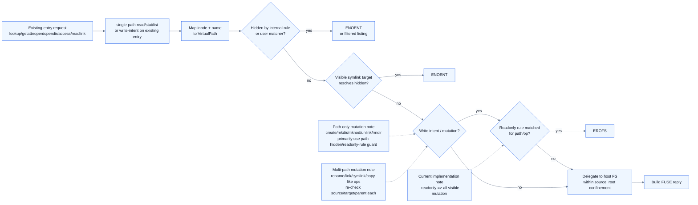
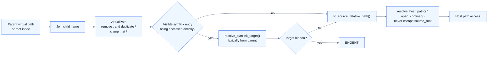

# holefs 설계 문서

이 문서는 `holefs`를 구현하기 위한 설계 기준이다. 현재 저장소에는 v1 핵심 모듈의 초기 구현이 포함되어 있지만, 이 문서는 여전히 구현 완료 선언이 아니라 구현자가 따라야 할 계약이다.

아키텍처 시각화 요약은 [docs/architecture.md](architecture.md)에 정리되어 있다. 다이어그램 원본과 공용 렌더링 규칙은 [docs/diagrams/README.md](diagrams/README.md)를 따른다. `docs/diagrams/*.png`는 `docs/diagrams/mermaid-config.json`, `docs/diagrams/puppeteer-config.json`을 함께 사용하고 Mermaid CLI `--scale 2`로 렌더링하는 것을 기준으로 읽는다.

> Implementation status note (2026-06): initial v1 core modules for `cli`, `config`, `errors`, `path`, `matcher`, and `fs` now exist. Current partial implementation status also includes visible-path `access` pass-through, symlink-target guards on `lookup`/`open`/`readlink`, readonly `create` -> `EROFS` handling, readonly/hidden multi-path mutation guard coverage, handler-level readonly enforcement with mount-level `ro` still disabled, and 43 mount-free unit tests covering path normalization, matcher behavior, readonly precedence, symlink-target hiding, source-root symlink escape rejection, mount-root recursion exclusion, CLI parsing, FUSE read/list/access/xattr guard behavior, and `copy_file_range` visible/hidden paths. Current source also contains `--readonly-rule` parsing plus readonly matcher plumbing. Latest real-FUSE evidence now includes successful repo-local and `source-root=/` whole-root mounts in an environment where `/dev/fuse` exists; the smoke results confirmed hidden-path `ENOENT`, readonly mutation `EROFS`, `stat /bin/bash`, and `ls /usr`. `unshare -UrR <mount> /bin/true` and `unshare -UrR <mount> /bin/bash --noprofile --norc ...` now succeed, confirming user-namespace chroot execution smoke. Current validation and live evidence still center on the global `--readonly` boolean. The broader selective readonly rule contract described below must therefore be read separately from that currently verified evidence. This is partial implementation progress only; the design requirements below still define the remaining v1 contract.

## 한눈에 보기

### 시스템 컨텍스트


### 요청 처리 흐름



### 모듈 구조


## 빠른 읽기 가이드

- **무엇을 만드는가**: 1~4절
- **코드 경계와 데이터 흐름**: 5~8절
- **의미론과 errno 계약**: 9~11절
- **magic fs / device / integration boundary**: 12절
- **성능·검증·수용 기준**: 13절 이후

## 현재 구현 vs 목표 계약

| 관점 | 현재 구현에서 확인된 것 | 여전히 설계 목표로 읽어야 하는 것 |
| --- | --- | --- |
| hidden/readonly 기본 의미론 | hidden=`ENOENT`, readdir 필터링, visible mutation=`EROFS` under global `--readonly` | hide와 별개인 selective readonly rule(특정 path/pattern만 `EROFS`) 의미론과 edge case hardening |
| readonly 설정 표면 | current source에는 global `--readonly` bool + `--readonly-rule` parser/matcher surface가 있고, current 검증 evidence는 주로 global `--readonly` bool 기준 | selective readonly rule 표현식과 검증 matrix 정리, live evidence 보강 |
| rule 입력 정규화 | exact hide rule은 이미 absolute virtual path여야 하고 limited glob만 허용 | path-like rule surface(exact + supported prefixed glob)에 대한 relative/leading `~` expansion, fail-fast semantics, hide+future readonly 공용 normalization contract |
| symlink 처리 | direct symlink-entry guard, hidden target 차단, source-root escape rejection | broader ancestor-symlink traversal hardening |
| whole-root view | `source-root=/` mount smoke, `/bin`/`/usr`/`/etc` 확인 | 상위 supervisor와의 production integration |
| chroot 실행 | `unshare -UrR` 기반 smoke 확인 | plain `chroot` 운영 모델 정리 |
| device semantics | `nodev` 제약 문서화 | `/dev/null` 등은 supervisor/namespace layer 제공 |

## 1. 설계 목표

이 절은 이 문서 전체가 만족해야 하는 상위 제품/시스템 목표를 고정한다.

`holefs`는 sandbox/chroot 같은 whole-root consumer가 읽을 수 있는 non-root FUSE 기반 filesystem view layer다. `pi-bash-sandbox`는 대표 통합 시나리오지만, 이 설계는 특정 supervisor 하나에 고정되지 않는 일반화된 view layer 계약을 목표로 한다.

핵심 목표:

- non-root 사용자 권한으로 `fusermount3` 기반 FUSE3 mount를 생성한다.
- `fractal-fuse = 0.4.0` 기반으로 구현한다.
- v1은 `FUSE_OVER_IO_URING` 사용을 필수로 하며, 협상 실패 시 fallback 없이 명시적 오류로 fail-fast 한다.
- 전체 `/` view를 상위 whole-root consumer(대표 예시: chroot root)에게 제공한다.
- 기본은 underlying filesystem pass-through이며, hide rule에 걸린 경로만 없는 것처럼 숨긴다.
- hidden path는 가능한 한 `ENOENT`로 처리해 존재를 노출하지 않는다.
- hide와 별개인 selective readonly rule에 매칭된 visible mutation은 `EROFS`로 거부한다. 정확한 CLI/config syntax는 TBD다.
- metadata-heavy workload를 고려해 `readdirplus`, matcher/cache, handle lifecycle을 설계한다.


구현 파일 바로가기: `README.md`, `docs/requirements.md`, `docs/architecture.md`

## 2. Threat model, integration assumptions, non-goals

이 절은 구현 범위를 넘는 책임을 미리 잘라서 설계 오해를 줄인다.

`holefs`는 path-hiding filesystem view layer다. 단독 sandbox 또는 완전한 host isolation boundary가 아니다.

통합 전제:

- `holefs` mount 생성은 non-root 사용자 권한으로 가능해야 한다.
- `chroot` 실행은 별도 권한 모델이 필요할 수 있다. `holefs`는 `CAP_SYS_CHROOT`, privileged supervisor, user namespace 구성, 또는 동일 host uid 실행 정책을 직접 제공하지 않는다.
- 상위 supervisor/namespace layer(예: `pi-bash-sandbox`)는 `holefs`가 제공한 whole-root view를 어떤 sandbox/chroot consumer에 연결할지 결정한다.
- chroot 내부 프로세스가 FUSE mount owner와 동일 host uid로 접근하는 것이 기본 전제다.
- 다른 host uid가 접근해야 하면 `allow_other`가 필요할 수 있으며, 이는 `/etc/fuse.conf`의 `user_allow_other` 및 mountpoint 권한 정책에 의존한다.
- project/sandbox 상위 레이어는 process, network, namespace, cgroup, seccomp 같은 isolation을 별도로 담당한다.

Non-goals:

- `/dev/null` bind overlay, tmpfs overlay, privileged bind mount 방식 masking은 사용하지 않는다.
- device node semantics, setuid behavior, procfs/sysfs caller-relative semantics를 `holefs` 단독으로 완전히 재현하지 않는다.
- v1 hide guarantee는 virtual path 기반이다. hardlink alias는 별도 hide rule 없이는 자동 차단하지 않는다. symlink는 **목표 계약상** entry path와 resolved virtual target을 모두 검사해 hidden target으로의 symlink traversal을 `ENOENT`로 차단한다. 현재 구현에서 직접 확인된 범위는 status note와 `docs/architecture.md`에 정리된 direct symlink-entry guard다.


구현 파일 바로가기: `AGENTS.md`, `docs/requirements.md`, `docs/operations.md`

## 3. Filesystem view model

이 절은 사용자가 실제로 보게 될 virtual filesystem의 기본 모양을 정의한다.

요약:

- 입력: `source_root`, `mount_root`
- 출력: whole-root consumer(sandbox/chroot 등)가 읽는 virtual root
- 기본 정책: 전체 view pass-through + selective hiding

`holefs`는 source root와 mount root를 받는다. chroot 사용을 위해 기본 source root는 `/`를 상정한다.

```text
source root: /
mount root:  /tmp/holefs-root
chroot root: /tmp/holefs-root
```

mount root 아래의 virtual path는 source root 아래의 같은 상대 경로로 해석한다.

```text
/tmp/holefs-root/usr/bin/bash -> /usr/bin/bash
/tmp/holefs-root/etc          -> /etc
```

hide rule에 매칭되지 않는 visible path는 underlying filesystem으로 pass-through 한다.


구현 파일 바로가기: `src/main.rs`, `src/config.rs`, `src/path.rs`

## 4. Mount-root recursion exclusion

이 절은 whole-root mount에서 빠지기 쉬운 자기참조 문제를 방지하는 핵심 안전장치다.

`source root = /`이고 `mount root = /tmp/holefs-root`이면 mount root 자체가 source tree 안에 포함된다. 이 경로를 view 내부에 노출하면 다음과 같은 자기참조가 생긴다.

```text
/tmp/holefs-root/tmp/holefs-root/tmp/holefs-root/...
```

따라서 mount root의 source-relative subtree는 내부 자동 hide rule로 취급한다.

필수 정책:

- mount root subtree는 `readdir`/`readdirplus` 결과에서 제외한다.
- mount root subtree에 대한 `lookup`, `getattr`, `statx`, `open`, `opendir`, `access`, `readlink`, xattr 조회는 `ENOENT`다.
- 사용자 지정 hide rule보다 낮은 우선순위가 아니라 항상 적용되는 internal rule이다.
- 검증 시 mount 후 mounted view 내부에서 mount root entry가 다시 나타나지 않아야 한다.


구현 파일 바로가기: `src/config.rs`, `src/matcher.rs`, `src/fs.rs`

## 5. Architecture overview and module boundaries

이 절은 실제 코드 탐색 순서와 책임 분리를 한 번에 잡기 위한 지도다.

이 절은 실제 코드 모듈을 읽을 때의 지도 역할을 한다.

- 진입점: `src/main.rs`
- 정책 조립: `src/cli.rs`, `src/config.rs`, `src/matcher.rs`
- 경로 의미론: `src/path.rs`
- errno / guard: `src/errors.rs`
- FUSE 요청 처리 중심: `src/fs.rs`

권장 모듈 구조:

```text
src/main.rs      CLI entry, config loading, mount lifecycle
src/cli.rs       argument parsing and validation
src/config.rs    runtime config, current global readonly flag, compiled hide rules, future selective readonly config
src/path.rs      virtual path normalization and source-root resolution
src/matcher.rs   exact, prefix, glob hide matcher
src/inode.rs     inode table, reverse map, lookup/forget refcount
src/handle.rs    file and directory handle tables
src/backing.rs   host filesystem adapter using dirfd/openat-style access
src/errors.rs    errno mapping and operation classification
src/fs.rs        fractal-fuse Filesystem implementation
```

Data flow:

1. FUSE request arrives with inode/name or file handle.
2. Request is mapped to a virtual absolute path using inode/path state.
3. The virtual path is lexically normalized.
4. Internal mount-root exclusion and user hide matcher run first.
5. Hidden match returns `ENOENT` or excludes entry from listings.
6. Readonly-rule matching and mutation classification run next.
7. Visible reads/list/stat operations and visible mutations outside readonly scope are delegated to `backing`.
8. Results are converted to FUSE replies and caches are updated/invalidated.


구현 파일 바로가기: `src/lib.rs`, `src/main.rs`, `src/fs.rs`

## 6. Virtual path model and normalization

이 절은 hide/readonly 판정의 기준 좌표계가 무엇인지 고정한다.

이 절은 hide rule이 **host path**가 아니라 **virtual path** 기준으로 동작한다는 점을 기억하고 읽으면 이해가 빠르다.



Hidden matching uses a **lexically normalized absolute virtual path**, not `std::fs::canonicalize()`.

Rules:

- The virtual root is `/` regardless of source root.
- Absolute hide rules such as `/home/<user>/.ssh` are anchored at the virtual root.
- Relative input components are joined from the parent virtual path and child name.
- `.` and duplicate `/` are removed.
- `..` pops one component but cannot escape above virtual `/`.
- Existing path, nonexistent path, broken symlink, permission-denied parent, and automount boundaries must still be classifiable without host canonicalization.
- Source path resolution must not escape source root. Prefer pre-opened source root fd plus dirfd/openat-style operations over string-only host path concatenation.

### 6.1 Rule input normalization contract

Current implementation snapshot:

- `HideMatcher::new` accepts exact rules only when they already start with `/`.
- Non-absolute exact strings fail fast as invalid exact hide rules.
- The current glob parser accepts recursive basename or suffix forms such as `**/.env`, `**/*.pem`, `**/*.key`, and `**/*.lock`.
- Relative/tilde prefixed glob inputs such as `./fixtures/**/*.pem` and `~/fixtures/**/*.pem` already fail fast as unsupported hide globs.

Target/considered behavior for path-like rule inputs:

1. First classify whether the token is an exact-path candidate or one of the supported limited recursive globs.
2. Supported globs keep the current recursive tail grammar, but may gain an optional path prefix that is normalized before matcher compilation.
3. Already-absolute exact paths like `/home/<user>/.ssh` preserve the current virtual-root-anchored semantics.
4. Already-absolute prefixed globs like `/home/<user>/**/*.pem` preserve absolute-prefix semantics and compile to a virtual prefix plus the existing recursive basename/suffix tail.
5. Relative exact-path candidates and relative prefixed-glob prefixes are interpreted as host paths relative to the process cwd. Only when the expanded host path stays inside `source_root` may it be rebased to a source-root-relative virtual absolute path or virtual glob prefix.
6. Leading `~` and `~/...` exact or prefixed-glob candidates are expanded through `HOME`, then subjected to the same `source_root` containment check and rebasing.
7. Missing `HOME`, expanded paths outside `source_root`, and `~user` forms are all fail-fast errors.
8. Broader wildcard forms such as `foo/*/bar.pem`, `**/secret?.pem`, brace expansion, env-var expansion, and command substitution stay unsupported in this contract.
9. The existing `--readonly-rule` surface and any future expansion of that surface should reuse the same rule-input normalization contract so hide and readonly classify the same virtual path or glob prefix before policy matching.
10. Current implementation and validation evidence still stop before this contract: they use already-normalized absolute exact rules plus prefix-less basename/suffix globs, and verified readonly evidence still centers on the current global `--readonly` bool.


구현 파일 바로가기: `src/path.rs`, `src/fs.rs`, `src/matcher.rs`, `src/cli.rs`

## 7. Hide policy and matcher

이 절은 어떤 입력 rule이 어떤 경로를 숨기게 되는지의 정책 표면을 정의한다.

Target contract 기준으로 hide rules는 exact path와 제한된 glob pattern을 지원한다. Current implementation snapshot에서는 exact rule이 이미 absolute virtual path여야 하고 glob도 제한된 grammar만 허용한다.

Examples:

```text
/home/<user>/.ssh
/home/<user>/.aws
/home/<user>/.gnupg
/home/<user>/.pi/agent/auth.json
/home/<user>/.pi/agent/mcp-oauth
**/.env
**/*.pem
**/*.key
```

Matcher structure:

- internal prefix rules: mount-root recursion exclusion
- exact absolute rule set: single path entries after current or future exact-path normalization
- hidden directory prefix set: exact directory hides its whole subtree
- compiled glob matcher: recursive basename/suffix forms such as `**/.env`, `**/*.pem`, `**/*.key`, `**/*.lock`
- optional per-path hidden result cache keyed by normalized virtual path and rule version

Symlink target cache policy:

- The per-path hidden result cache may cache only direct rule matching for the normalized virtual path.
- Hidden decisions that depend on reading and resolving a symlink target must not be cached in the direct per-path hidden cache.
- v1 avoids reverse dependency tracking for symlink targets; symlink target checks are recomputed when `readlink`, traversal, or open-through-symlink classification needs them.
- Writable `rename`, `link`, `symlink`, `unlink`, and `setattr` mutations invalidate affected parent directories, alias indexes, and path/inode cache entries.
- If a later implementation adds symlink-target caching, it must add reverse dependency invalidation before enabling that cache.

Policy:

- Hidden decision is path-based in v1.
- A hidden directory hides the directory itself and all descendants.
- In directory listing, each child virtual path is checked before returning it.
- `readdirplus` must not return metadata for entries excluded by hidden rules.
- Symlink entries are matched by their own virtual path and by a lexically resolved virtual target when the link target can be interpreted inside the view.
- `readlink` on a symlink whose own path or resolved virtual target is hidden returns `ENOENT`.
- 목표 계약상 opening or traversing through a symlink must re-apply hidden matching to the resolved virtual target before host delegation. 현재 구현/증거 범위는 status note와 `docs/architecture.md`의 current-state 설명을 따른다.
- Broken symlinks whose own path is visible can be listed/readlinked if the target cannot be resolved to a hidden virtual path.
- Hardlink aliases remain visible unless their own virtual path matches a hide rule. This limitation is documented behavior; users must hide every sensitive hardlink path or avoid exposing hardlink aliases.


구현 파일 바로가기: `src/matcher.rs`, `src/config.rs`, `src/fs.rs`

## 8. Inode, path, and handle model

이 절은 path 기반 정책을 inode 기반 FUSE 요청에 어떻게 연결할지 설명한다.

FUSE is inode-centric, while hide rules are path-centric. `holefs` maintains both views.

Inode table:

- FUSE root inode is fixed to `FUSE_ROOT_ID = 1`.
- Visible host objects receive synthetic FUSE inode ids.
- Reverse identity can use `(st_dev, st_ino)` for stable visible objects, with a path alias index for path-based hiding decisions.
- Hidden paths are never exported into the inode table.
- `lookup` increments lookup/refcount state; `forget` and `batch_forget` decrement and allow eviction.
- Stale inode/path associations must be invalidated after successful mutation in writable mode.

File handle table:

- `open`/`opendir` allocate file or directory handles.
- `read`/`readdir`/`readdirplus` use handles for the lifetime of the request stream.
- `release`/`releasedir` close underlying fd/backing resources and remove handle table entries.
- Baseline correctness may use ordinary `open`/`pread`/directory enumeration. `fractal-fuse` passthrough `backing_id` optimization is a later phase unless lifecycle is fully specified.

Directory iteration:

- `opendir` creates a per-handle visible entry snapshot after applying hidden filters.
- `readdir`/`readdirplus` use synthetic index-based cookies into that snapshot.
- Writable mutations invalidate affected directory snapshots and path/inode caches.
- This snapshot model is the v1 correctness baseline; streaming enumeration can be optimized later.


구현 파일 바로가기: `src/fs.rs`

## 9. FUSE operation matrix

이 절은 개별 FUSE operation이 hidden/readonly와 만나면 어떤 errno를 내야 하는지 빠르게 찾기 위한 표다.

이 표는 구현자가 가장 자주 참고해야 하는 의미론 요약이다.

아래 표의 **목표 계약**은 hide와 별개인 selective readonly rule을 기준으로 읽는다. 현재 구현은 아직 global `--readonly` bool만 지원하므로, 현재 빌드/검증에서는 아래의 `Visible path matched by readonly rule` 열을 "`--readonly`가 켜진 동안의 모든 visible path"로 해석해야 한다.

### 9.1 조회 / 탐색 연산

| Operation class | Hidden path behavior | Visible path matched by readonly rule | Visible path not matched by readonly rule |
| --- | --- | --- | --- |
| `lookup`, `getattr`, `statx`, `access` | `ENOENT` | pass-through | pass-through |
| `opendir` | `ENOENT` | pass-through handle | pass-through handle |
| `readdir`, `readdirplus` | exclude entries | filtered listing | filtered listing |
| `open` read-only intent | `ENOENT` | pass-through handle | pass-through handle |
| `read`, `flush`, `fsync`, `release` | hidden handles must not exist | pass-through/close | pass-through/close |
| `readlink` | `ENOENT` | pass-through target | pass-through target |
| `statfs` | not path-hidden except mount-root policy | pass-through or synthesized source stats | pass-through or synthesized source stats |

### 9.2 쓰기 / 생성 / 삭제 연산

| Operation class | Hidden path behavior | Visible path matched by readonly rule | Visible path not matched by readonly rule |
| --- | --- | --- | --- |
| `open` write intent (`O_WRONLY`, `O_RDWR`, `O_TRUNC`, create-like flags) | `ENOENT` | `EROFS` | pass-through if allowed by host |
| `write` | `ENOENT` if handle should not exist because path is hidden | `EROFS` | pass-through if allowed by host |
| `create`, `mkdir`, `mknod` | `ENOENT` | `EROFS` if the created path or mutated parent matches a readonly rule | pass-through if allowed by host |
| `unlink`, `rmdir` | `ENOENT` | `EROFS` if the removed path or mutated parent matches a readonly rule | pass-through if allowed by host |
| `fallocate` | `ENOENT` | `EROFS` | pass-through if allowed by host |

### 9.3 메타데이터 / xattr 연산

| Operation class | Hidden path behavior | Visible path matched by readonly rule | Visible path not matched by readonly rule |
| --- | --- | --- | --- |
| `getxattr`, `listxattr` | `ENOENT` | pass-through or conservative unsupported error | pass-through or conservative unsupported error |
| `setxattr`, `removexattr` | `ENOENT` | `EROFS` | pass-through if allowed by host |
| `setattr` mutation (`chmod`, `chown`, `truncate`, `utimens`) | `ENOENT` | `EROFS` | pass-through if allowed by host |

### 9.4 멀티패스 연산

| Operation class | Hidden path behavior | Visible path matched by readonly rule | Visible path not matched by readonly rule |
| --- | --- | --- | --- |
| `rename` | `ENOENT` for any hidden source/target/parent involved | `EROFS` if any mutated visible source/target/parent matches a readonly rule | pass-through if allowed by host |
| `link`, `symlink` | `ENOENT` for any hidden source/target/parent involved | `EROFS` if any mutated visible source/target/parent matches a readonly rule | pass-through if allowed by host |
| `copy_file_range` with destination mutation | `ENOENT` for any hidden source/target/parent involved | `EROFS` if any mutated visible destination/parent matches a readonly rule | pass-through if allowed by host |

멀티패스 보충 규칙:

- `rename`, `link`, `symlink`, and copy-like mutation operations classify every involved source, target, and parent virtual path against hide rules and readonly rules.
- If any involved path is hidden, return `ENOENT` to avoid exposing hidden existence.
- If no involved path is hidden and any mutated visible path/parent is matched by a readonly rule, return `EROFS`.
- Current implementation snapshot: when global `--readonly` is active, it applies the same `EROFS` result to all visible mutations regardless of per-path match.
- Otherwise delegate to the underlying filesystem and preserve host errno where possible.


구현 파일 바로가기: `src/fs.rs`, `src/errors.rs`

## 10. Readonly implementation strategy

이 절은 readonly 판정이 요청 흐름 안에서 언제, 어떻게 적용되는지 설명한다.

핵심 질문: "이 요청이 hidden인가, readonly rule에 매칭된 visible mutation인가, 아니면 허용되는 visible access인가?"

**목표 계약**

1. Build normalized virtual path(s).
2. Apply mount-root exclusion and hide matcher.
3. If hidden, return `ENOENT` regardless of readonly rule state.
4. Determine every mutated path, parent, source, and target the operation can affect.
5. Apply selective readonly rules to those visible paths.
6. If any affected visible path is readonly-matched and the operation mutates state or opens with write intent, return `EROFS`.
7. Delegate visible read/stat/list operations and visible mutations outside readonly scope to the host filesystem.

**현재 목표 계약과 향후 고려를 구분해서 읽을 점**

- 현재 목표 계약은 writable-by-default + path-scoped selective readonly deny rules다.
- `readonly-root` + `allowWrite` carve-out 같은 alternate default/override model은 향후 설계 가능성으로만 남아 있으며, precedence, overlap resolution, CLI shape, verification은 모두 TBD다.
- 따라서 현재 문서의 selective readonly 표와 checklist를 future carve-out 정책으로 확장 해석하면 안 된다.

**현재 구현 상태**

- The handler still enforces a global `--readonly` boolean before host delegation.
- In current code/tests, step 5 is effectively "treat every visible path as readonly-matched when `--readonly` is enabled."
- Handler-level guards are the source of truth. Mount-level read-only remains disabled and is not relied on for semantics.


구현 파일 바로가기: `src/fs.rs`, `src/errors.rs`, `src/main.rs`

## 11. Errno mapping

이 절은 사용자 공간에서 어떤 실패가 어떤 errno로 보일지 일관되게 맞추기 위한 규칙이다.

Error mapping rules:

- hidden path: `ENOENT`
- hidden entry in listing: omit entry
- readonly-matched mutation: `EROFS`
- host `io::Error::raw_os_error()`: preserve raw errno
- no raw errno: `EIO`
- wrong type: preserve host `ENOTDIR`, `EISDIR`, or equivalent errno
- host permission failure on visible path: preserve `EACCES`/`EPERM`
- unsupported optional op: return the least surprising FUSE-compatible errno, and document unsupported status if visible to callers


구현 파일 바로가기: `src/errors.rs`, `src/fs.rs`

## 12. Magic filesystem and device policy

이 절은 whole-root view가 곧 native kernel filesystem 재현을 의미하지 않는다는 점을 분명히 한다.

Whole `/` view does not imply transparent kernel filesystem reproduction.

Policy:

v1 policy is fixed as follows:

| Path family | holefs v1 policy | Responsible layer |
| --- | --- | --- |
| `/proc`, `/proc/self`, `/proc/thread-self` | ordinary visible path traversal only; procfs caller-relative semantics are not guaranteed | 상위 supervisor/namespace layer (예: `pi-bash-sandbox`) |
| `/sys` | ordinary visible path traversal only; kernel sysfs semantics are not guaranteed | 상위 supervisor/namespace layer (예: `pi-bash-sandbox`) |
| `/dev`, `/dev/null`, `/dev/zero`, `/dev/urandom` | device node semantics are not guaranteed because non-root FUSE mounts commonly imply `nodev` | 상위 supervisor/namespace layer (예: `pi-bash-sandbox`) |
| `/dev/fd`, `/dev/stdin`, `/dev/stdout`, `/dev/stderr` | fd-relative semantics are not guaranteed | 상위 supervisor/namespace layer (예: `pi-bash-sandbox`) |
| `/run` | ordinary visible path traversal only; runtime socket/service availability is not guaranteed | 상위 supervisor/namespace layer (예: `pi-bash-sandbox`) |

`holefs` v1 therefore treats these as ordinary visible paths unless hidden by rule, while explicitly not claiming native magic filesystem/device behavior. 특정 sandbox/chroot consumer가 이 경로들에 native behavior를 요구하면, 상위 supervisor가 `holefs` 바깥에서 별도 namespace/mount 구성을 제공해야 한다.


구현 파일 바로가기: `README.md`, `docs/operations.md`, `docs/requirements.md`

## 13. FUSE3, io_uring, and mount options

이 절은 mount가 성공하기 위한 런타임 전제와 옵션 판단 기준을 정리한다.

Implementation uses `fractal-fuse = 0.4.0` and FUSE3.

Startup policy:

- Detect availability of `/dev/fuse`, FUSE support, `fusermount3`, and relevant kernel/session capabilities.
- The current development environment also has a documented kernel config artifact at `/home/spi-ca/Codebase/packages/managed/linux-spica-git/config.saved.x86_64` with `CONFIG_FUSE_IO_URING=y` and `CONFIG_IO_URING=y`.
- v1 requires `FUSE_OVER_IO_URING` negotiation to succeed.
- Kernel config evidence is only a prerequisite signal; live session negotiation still has to succeed at runtime.
- If io_uring transport is unavailable or session negotiation fails, v1 fails fast with an explicit startup error and does not mount.
- A non-io_uring fallback can be added only as a separately documented compatibility mode in a later version.

Mount options to evaluate:

- `default_permissions`: use only if it preserves required `access` and hidden `ENOENT` behavior.
- `allow_other`: not part of v1 default behavior. Same-host-uid access is the v1 contract. A future explicit `--allow-other` option must require `/etc/fuse.conf` `user_allow_other`, restrictive mountpoint permissions, and a security warning.
- `ro`: mount-level read-only cannot express selective readonly rules, so it cannot be the source of truth for the target contract. It is only a possible whole-mount defense in depth for the current global `--readonly` implementation or for a future explicit full-readonly mode.
- `force_readdir_plus`: consider enabling if compatible with `fractal-fuse` and workload.
- passthrough/backing fd optimization: phase 2 after correctness baseline.


구현 파일 바로가기: `src/main.rs`, `Cargo.toml`, `docs/operations.md`

## 14. Cache and memory model

이 절은 성능 최적화가 correctness와 메모리 상한을 깨지 않도록 제약을 건다.

Caches must improve metadata-heavy workload without unbounded memory growth.

Recommended caches:

- path hidden result cache: normalized virtual path -> hidden decision, keyed by rule version
- inode table: FUSE inode -> host identity/path state/refcount
- reverse map: host `(st_dev, st_ino)` -> FUSE inode for visible objects
- directory snapshot cache: per open directory handle or short-lived filtered listing
- file/dir handle table: bounded by open handle lifecycle

Policy:

- Set explicit cache size limits or LRU eviction.
- Use conservative `entry_timeout`, `attr_timeout`, and `negative_timeout` until correctness is proven.
- In writable mode, successful mutation invalidates affected parent directory, involved path entries, and related inode/path cache entries.
- For paths covered by readonly rules, longer TTLs can be considered but must not hide external host changes beyond documented limits.
- Track long-running RSS and fd counts during performance tests.


구현 파일 바로가기: `src/fs.rs`, `docs/operations.md`

## 15. Performance model

이 절은 v1이 느려지지 않았다고 말할 수 있는 최소 기준을 제시한다.

전체 `/` view는 `find`, shell startup, dynamic linker lookup 등 metadata-heavy workload가 많다.

Reference acceptance targets for v1 on the documented development environment:

- Repeated hidden matcher unit benchmark with 10,000 normalized paths and 100 hide rules completes within 2x the same loop with no hide rules plus 200 ms.
- FUSE mount idle RSS after startup remains below 128 MiB.
- After five repeated traversals of a 10,000-entry fixture tree, RSS growth remains below 64 MiB from post-startup baseline.
- After five repeated traversals, open fd count returns to within 16 fds of post-startup baseline.
- `readdirplus` of a 10,000-entry fixture directory completes without unbounded memory growth; the per-directory snapshot is released by `releasedir`.
- If the reference environment changes materially, new thresholds must be recorded with kernel, CPU, memory, and hide rule count.

Implementation priorities:

- implement `readdirplus`
- avoid per-entry host canonicalization
- compile hide rules once at startup
- use exact/prefix/glob matcher tiers
- maintain bounded inode/path caches
- reuse open handles during their lifetime
- keep visible file data path close to underlying filesystem; zero-copy/pass-through optimization is phase 2
- avoid unbounded directory snapshot retention


구현 파일 바로가기: `docs/operations.md`, `docs/requirements.md`

## 16. CLI shape

이 절은 사용자에게 노출되는 인터페이스를 문서와 구현 사이에서 일치시키기 위한 기준이다.

목표 계약에서 readonly는 hide와 별도의 selective rule surface여야 한다. 정확한 CLI syntax는 아직 확정되지 않았으므로 TBD로 둔다.

Target CLI shape (syntax TBD):

```text
holefs <source-root> <mount-root> [--hide <pattern> ...] [TBD selective readonly rule options]
```

Future CLI requirements:

- hide rules and readonly rules must be configured independently.
- current target readonly rules must support path/pattern scoping rather than only whole-mount mode.
- exact path inputs may later accept relative paths and leading `~` / `~/...`, but only under the documented source-root rebasing contract.
- supported glob grammar remains limited to the current recursive basename/suffix tails (`**/<basename>`, `**/*.<suffix>`) while allowing an optional normalized absolute/relative/tilde path prefix such as `./fixtures/**/*.pem`, `~/fixtures/**/*.pem`, or `/home/<user>/**/*.pem`.
- missing `HOME`, expanded paths outside `source_root`, and `~user` forms must remain fail-fast errors.
- broader wildcard forms outside that prefix+tail contract remain unsupported.
- the existing `--readonly-rule` parsing/matcher surface and any future expansion of that surface should reuse the same rule-input normalization contract as hide rules.
- alternate policy families such as `readonly-root` + `allowWrite` carve-out, if ever introduced, must be documented as a separate policy model with explicit precedence/overlap rules rather than inferred from the current target contract.
- the current global `--readonly` flag is an implementation placeholder, not the final contract.

Current implementation snapshot:

```text
holefs <source-root> <mount-root> [--readonly] [--hide <pattern> ...]
```

Current example:

```bash
holefs / /tmp/holefs-root \
  --hide /home/spi-ca/.ssh \
  --hide /home/spi-ca/.aws \
  --hide /home/spi-ca/.pi/agent/auth.json \
  --hide /home/spi-ca/.pi/agent/mcp-oauth \
  --hide '**/.env' \
  --hide '**/*.pem' \
  --hide '**/*.key'
```

Current readonly smoke example (still global, not selective):

```bash
holefs / /tmp/holefs-root \
  --readonly \
  --hide /home/spi-ca/.ssh
```


구현 파일 바로가기: `src/cli.rs`, `src/main.rs`, `README.md`

## 17. Validation strategy

이 절은 어떤 근거가 있으면 "동작한다"고 말할 수 있는지 검증 층위를 나눈다.

Validation is split into unit, integration, mount smoke, and system smoke levels. Readonly-related validation must be read in two tracks: the **target selective readonly contract** and the **current global `--readonly` implementation coverage**.

### Unit tests

- lexical virtual path normalization
- source-root escape prevention
- current implementation coverage: exact hide rule matching with already-absolute virtual paths
- current implementation coverage: limited glob hide rule matching and rejection of unsupported relative/tilde prefixed glob inputs
- target contract: relative exact path rebasing from process cwd into a virtual absolute path when inside `source_root`
- target contract: relative prefixed-glob rebasing from process cwd into a virtual glob prefix when inside `source_root`
- target contract: leading `~` / `~/...` expansion through `HOME` for exact and prefixed-glob inputs plus `source_root` containment checks
- target contract: fail-fast errors for missing `HOME`, `~user`, and expanded paths outside `source_root`
- hidden directory prefix matching
- mount-root recursion exclusion
- selective readonly rule matching for path/pattern-scoped rules (target contract)
- affected-path mutation classification, including write-intent `open` and multi-path operations (target contract)
- current implementation coverage: global `--readonly` operation classifier, including write-intent `open`
- errno mapping
- inode table lookup/forget/refcount behavior
- readdir snapshot cookie behavior

### Integration tests without mount

- tempdir-backed host fixture
- visible lookup/getattr/open/read/list behavior
- hidden lookup/getattr/open/access/readlink/xattr behavior
- filtered `readdir` and `readdirplus`
- target rule-input normalization contract: relative cwd-based rebasing and `HOME`-based rebasing for exact and supported prefixed-glob inputs
- target rule-input normalization fail-fast cases: missing `HOME`, `~user`, expanded path outside `source_root`, broader unsupported wildcard forms
- selective readonly rule application to matching and non-matching visible paths (target contract)
- multi-path op classification for hidden source/target/parent and readonly-matched source/target/parent (target contract)
- current implementation coverage: global `--readonly` `EROFS` precedence after hidden `ENOENT`
- cache invalidation after writable mutation
- symlink target hidden checks are not served from stale direct-path hidden cache
- alias index updates after `link`, `rename`, and `unlink`

### FUSE mount smoke tests

- `ls`, `find`, `rg` do not list hidden entries
- `stat`, `cat`, `access` on hidden path fail with `ENOENT`
- hidden directory and descendant paths are hidden
- mount root subtree is not visible through the mounted view
- `/bin`, `/usr`, `/lib`, `/lib64`, `/etc`, `/home`, `/tmp`, `/var` are visible when not hidden
- `readlink` visible symlink behavior matches documented policy
- symlink whose resolved virtual target is hidden returns `ENOENT`
- hardlink alias limitation is documented and tested as path-based behavior
- once rule-input normalization lands, smoke exact relative-path and `~` / `~/...` rule inputs separately from already-absolute inputs
- also smoke supported prefixed globs such as `./fixtures/**/*.pem`, `~/fixtures/**/*.pem`, and `/home/<user>/**/*.pem`
- keep broader unsupported wildcard forms in fail-fast smoke (for example `foo/*/bar.pem`, `**/secret?.pem`) rather than implicit shell expansion
- target contract: readonly-matched paths reject `touch`, `mkdir`, `rename`, `chmod`, `truncate`, `setxattr`, and write-intent `open` with `EROFS`, while visible non-matching paths remain writable if the host allows it
- current implementation smoke: the same mutation cases still use global `--readonly` until selective CLI/config lands

### System smoke tests

- confirm `fusermount3` path and version
- confirm `/dev/fuse` and kernel FUSE support
- confirm the documented kernel config artifact still shows `CONFIG_FUSE_IO_URING=y` and `CONFIG_IO_URING=y` when using the referenced development kernel
- confirm same-uid access model or explicit `allow_other` policy
- `chroot` smoke only when the required privilege/user namespace model is available
- bash startup and dynamic linker/shared library access through mounted view
- `/proc`, `/sys`, `/dev`, `/run` policy smoke confirms ordinary path-only behavior and documents supervisor-owned native semantics
- once selective readonly CLI/config is defined, add exact path/pattern smoke cases and document current fallback coverage separately
- when exact-path normalization lands, add explicit system smoke for `HOME`-unset fail-fast, `source_root`-outside fail-fast, and `~user` unsupported errors
- large traversal with many hide rules while checking the v1 latency, RSS, and fd-count targets
- daemon shutdown and `fusermount3 -u` cleanup behavior


구현 파일 바로가기: `src/fs.rs`, `docs/operations.md`, `README.md`

## 18. Role review status

이 절은 이 문서가 어떤 리뷰 관점을 거쳐 정제되었는지 추적 가능하게 남긴다.

This design incorporates repeated parallel design-review findings from the listed review roles used when this design was written:

- `user-representative`
- `software-systems-engineer`
- `software-designer`
- `software-implementer`
- `software-qa`
- `software-reviewer`

Resolved review themes:

- mount-root recursion exclusion
- lexical path matching instead of host canonicalization
- hidden directory subtree semantics
- symlink target checks and symlink-target-dependent cache policy
- hardlink path-based limitation
- inode/path/file handle model
- readdir/readdirplus snapshot model
- expanded operation matrix
- readonly write-intent `open` handling
- errno mapping
- chroot permission and same-host-uid/`allow_other` assumptions
- magic filesystem/device policy
- FUSE3/io_uring v1 fail-fast policy
- cache bounds and invalidation
- requirement-linked validation strategy

Final parallel design-review result: all listed design-review role subagents reported no blocking findings or blockers for this design.


구현 파일 바로가기: `docs/pi-agents.md`, `.pi/agents/`, `.pi/skills/`

